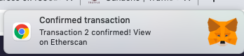

# First DApp project

First DApp is a project that builds a simple Ehtereum DApp (Descentralized App) in which the goal is creating a contract and sending the transaction, using all the blockchain theory as basis.

This project uses the following tools in order to reach its goal:
  - [Remix](https://remix.ethereum.org/)
  - [Ganache](https://www.trufflesuite.com/ganache)
  - [Metamask](https://metamask.io/)
  - [Infura](https://infura.io/)

## **Remix**
Remix is an online integrated development environment for creating smart contracts

## **Ganache**
Ganache helps building and testing applications using local own blockchain

## **Metamask**
Metamask is a browser extension that brings Ethereum into the browser

## **1. Connecting to Remix**
First thing is going to Remix and copying the code to a file called myMessage.sol (Solidity extension):


## **2. Connecting Remix to Ganache UI**
Open Ganache UI and then on Remix select Web3 Provider:


In order to change the Web3 provider endpoint so it can be used Ganache, on Remix after doing step 2 it'll be shown the following:


  - Change from 8545 to 7545
  - After that, click on **Deploy**

On Remix, it's going to show as successful:


## **3. Ganache UI**
On Ganache, it's going to show as a transaction called **Contract Creation**:


## **4. Getting the information from Remix to use on code**
In order to use the values of ABI and Address of the account, it's required to copy those from Remix.
Copying the ABI can be done as follows:


Then copying the Address of the acccount can be done like below:


**IMPORTANT**: Both ABI and Address account can be obtained using the [Etherscan website](https://etherscan.io/address/0xdac17f958d2ee523a2206206994597c13d831ec7)

## **5. Creating the network in Metamask**
Now it's needed to create a Custom RPC, click on Custom RPC which can be seen below:


After that, fill the required fields which are Network name, New RPC URL and Chain ID.
**RPC URL** is the one from Ganache: HTTP://127.0.0.1:7545
**Chain ID** is the id returned from the network in Ganache (in my case 1337)

After filling the fields, hit Save

Then, go to My Accounts and click in Import account:


On Ganache, go to Accounts and click in the key (Show keys) of one of the listed accounts:


Copy the private key from the window that pops up

On Metamask, paste it on the field "Paste your private key string here"

It should show the same value in Ether of the account on Ganache

**IMPORTANT**: In order to open Metamask when doing a transaction it requires the following before calling the ```setMessage(...):```:
    ```javascript
    window.ethereum.enable();
    ```
**Reference**: https://ethereum.stackexchange.com/questions/19524/invalid-address-error-when-interacting-with-a-smart-contract-with-metamask/65659#65659


## **6. Connecting to the Test Net**
In order to connect to the Test Net, it's required to use **Infura**.

On **Infura**, change the Endpoint to Rinkeby and copy the url, like below:


Then, replace the url copied with the one that is pointing to Ganache for the moment.

After that, open **Metamask** and select the Network **Rinkeby Test Network** and make sure it's connected.

Open **Remix** and change the Environment to *__Injected Web3__*
Then, click on **Deploy**

After doing the above, it's going to be shown the following on **Metamask**:


Going back to **Remix** it's going to be shown a notification of **Metamask**:



After a few seconds, it's going to be confirmed the transaction on **Remix**, like the following:


Copy the Contract address generated on **Remix**, like shown in the following:


Then replace the current address in the code.
