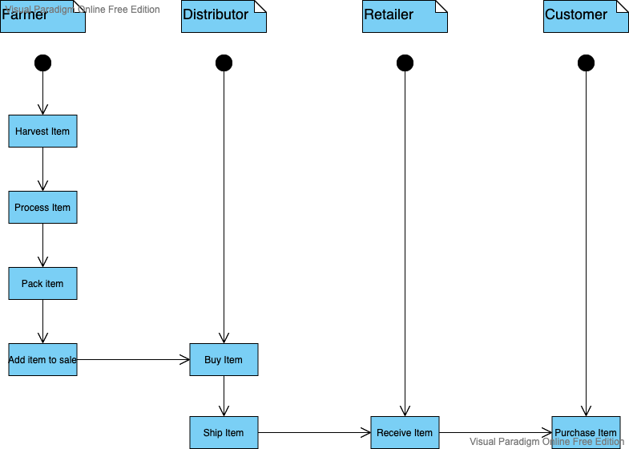
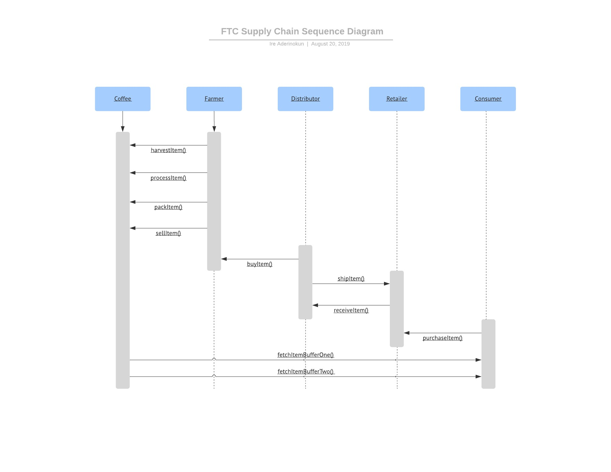
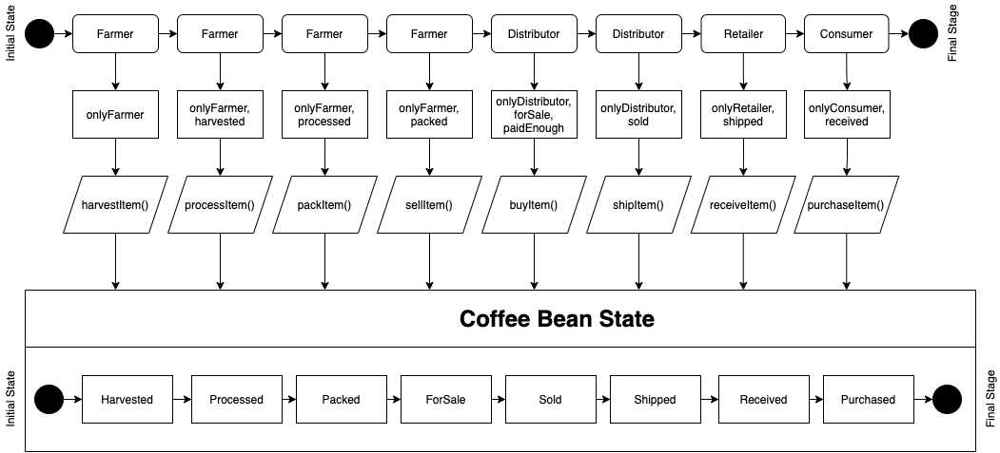
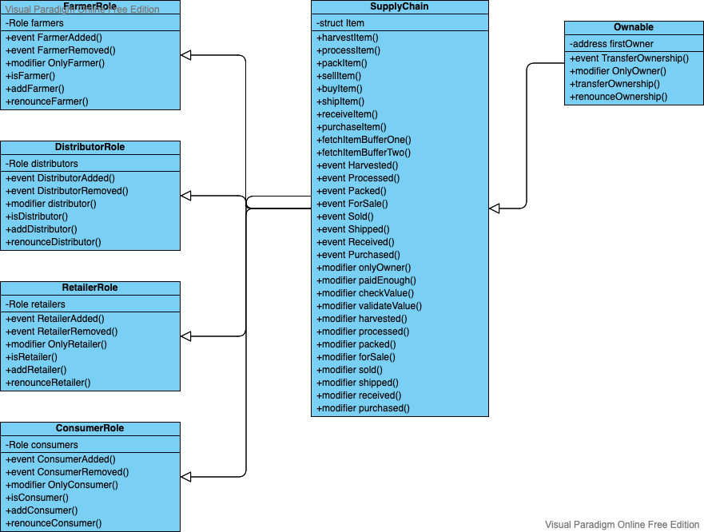

# About the project

This is a project from the Udacity course Blockchain Developer Nanodegree which has the goal to create a DApp supply chain solutions with Ethereum platform. For that, I have diagramed the UML diagrams to show the project's structure, the IPFS hosting and the development itself.

## UML Diagrams

### Activity diagram

 
 
 

### Sequence diagram

 
 
 

### State diagram

 
 
 

### Class diagram

 
 
 

### Libraries

**Truffle**: It was used to develop, test and deploy the smart contracts

